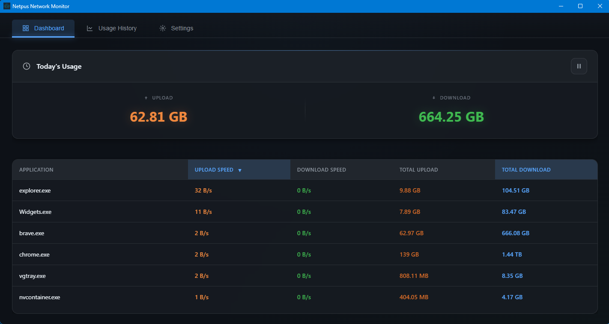
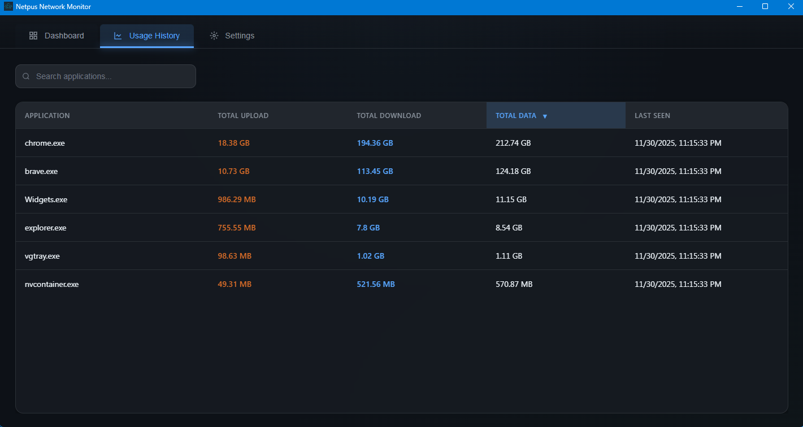
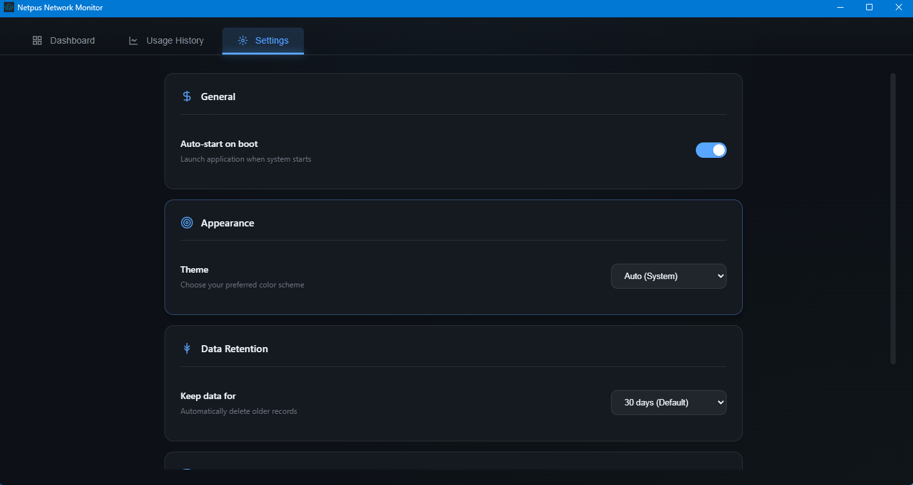

# Netpus

A lightweight, real-time network bandwidth monitor for Windows.

[](https://www.microsoft.com/windows)
[](https://go.dev/)
[](LICENSE)

<p align="center">
  
</p>

## ✨ Features

- 📊 **Real-time Monitoring** — Live network usage updated every second
- 📱 **Per-Application Tracking** — See exactly which apps consume your bandwidth
- 🔔 **System Tray** — Runs quietly in the background
- ⚡ **Lightweight** — Minimal CPU and memory footprint
- 🔒 **Privacy-First** — 100% offline, no data collection, no telemetry
- 📦 **One-Click Install** — Single script builds and installs everything

---

## 📸 Screenshots

### Dashboard
Real-time network monitoring with live upload/download speeds for each application.

<p align="center">
  
</p>

### History
Track your bandwidth usage over time with detailed historical data and trends.

<p align="center">
  
</p>

### Settings
Customize theme, data retention, auto-start behavior, and more.

<p align="center">
  
</p>

---

## 🚀 Quick Start

### Prerequisites

- [Go 1.22+](https://go.dev/dl/)

### Installation

```bash
git clone https://github.com/yourusername/netpus.git
cd netpus
```

Then simply run:

```batch
build.bat
```

That's it! The script will:
1. Install dependencies
2. Build the application
3. Create shortcuts (Desktop & Start Menu)
4. Register in Apps & Features
5. Launch Netpus

---

## 💻 Usage

### Running the App

Launch from:
- 🔍 **Windows Search** — Type "Netpus"
- 🖥️ **Desktop** — Double-click the shortcut
- 📌 **Taskbar** — Pin it for quick access

### System Tray

When you close the window, Netpus minimizes to the system tray. Right-click the tray icon for:
- Show/Hide Dashboard
- Pause/Resume Monitoring
- Quit Application

### Command Line Options

```bash
Netpus.exe                # Run normally
Netpus.exe --install      # Create shortcuts & register in Apps
Netpus.exe --uninstall    # Remove shortcuts & app data
Netpus.exe --version      # Show version info
```

---

## 🗑️ Uninstall

**Option 1:** Windows Settings
- Go to **Settings → Apps → Apps & Features**
- Search for "Netpus" and click **Uninstall**

**Option 2:** Command Line
```bash
Netpus.exe --uninstall
```

This removes:
- Desktop shortcut
- Start Menu shortcut
- Registry entries
- App data (`%LOCALAPPDATA%\Netpus`)

---

## 🛠️ Tech Stack

| Component | Technology |
|-----------|------------|
| Backend | Go 1.22+ |
| Frontend | Vanilla JS, HTML, CSS |
| Framework | [Wails v2](https://wails.io/) |
| Database | SQLite (local) |
| Platform | Windows 10/11 |

---

## 📁 Project Structure

```
netpus/
├── app.go              # Main application logic
├── main.go             # Entry point
├── build.bat           # One-click build & install
├── frontend/           # UI (HTML/CSS/JS)
│   ├── index.html
│   └── src/
├── internal/
│   ├── monitor/        # Network monitoring
│   ├── database/       # SQLite storage
│   ├── tray/           # System tray
│   └── autostart/      # Windows autostart
└── build/bin/          # Compiled executable
```

---

## 🤝 Contributing

Contributions are welcome! Feel free to:

1. Fork the repository
2. Create a feature branch (`git checkout -b feature/amazing-feature`)
3. Commit your changes (`git commit -m 'Add amazing feature'`)
4. Push to the branch (`git push origin feature/amazing-feature`)
5. Open a Pull Request

---

## 📄 License

This project is licensed under the MIT License — see the [LICENSE](LICENSE) file for details.

